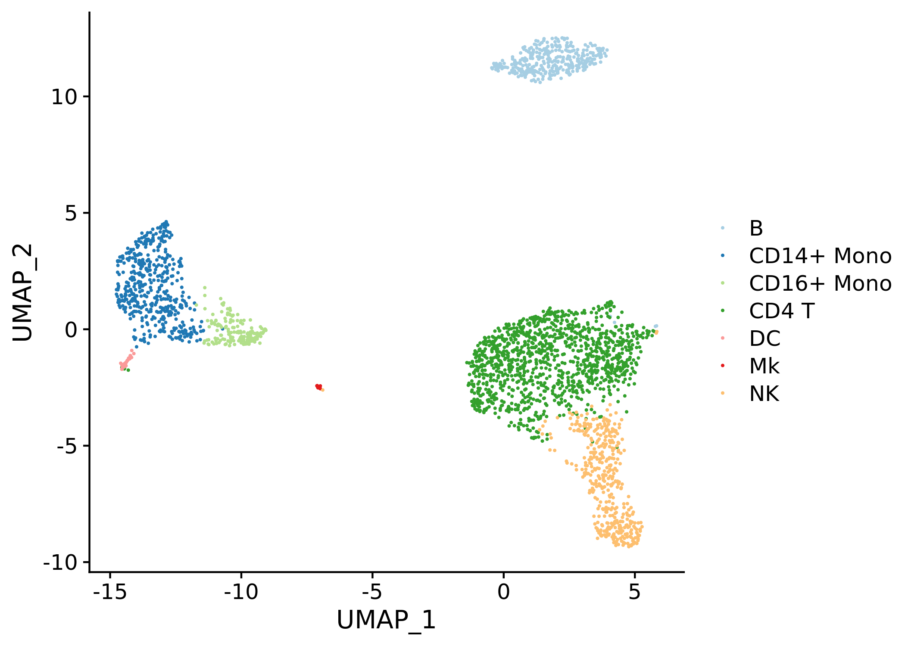

# clustifyr

<!-- badges: start -->

[](https://github.com/rnabioco/clustifyr/actions/workflows/check-bioc.yml)
[](https://app.codecov.io/gh/rnabioco/clustifyr?branch=devel)
[](https://bioconductor.org/packages/release/bioc/html/clustifyr.html)
[](https://bioconductor.org/packages/release/bioc/html/clustifyr.html)
[](https://bioconductor.org/packages/stats/bioc/clustifyr/clustifyr_stats.tab)
<!-- badges: end -->

clustifyr classifies cells and clusters in single-cell RNA sequencing
experiments using reference bulk RNA-seq data sets, sorted microarray
expression data, single-cell gene signatures, or lists of marker genes.

## Installation

Install the Bioconductor version with:

``` r
if (!requireNamespace("BiocManager", quietly = TRUE))
    install.packages("BiocManager")

BiocManager::install("clustifyr")
```

Install the development version with:

``` r
BiocManager::install("rnabioco/clustifyr")
```

## Example usage

In this example we use the following built-in input data:

- an expression matrix of single cell RNA-seq data (`pbmc_matrix_small`)
- a metadata data.frame (`pbmc_meta`), with cluster information stored
  (`"classified"`)
- a vector of variable genes (`pbmc_vargenes`)
- a matrix of mean normalized scRNA-seq UMI counts by cell type
  (`cbmc_ref`)

We then calculate correlation coefficients and plot them on a
pre-calculated projection (stored in `pbmc_meta`).

``` r
library(clustifyr)

# calculate correlation
res <- clustify(
    input = pbmc_matrix_small,
    metadata = pbmc_meta$classified,
    ref_mat = cbmc_ref,
    query_genes = pbmc_vargenes
)

# print assignments
cor_to_call(res)
#> # A tibble: 9 × 3
#> # Groups:   cluster [9]
#>   cluster      type           r
#>   <chr>        <chr>      <dbl>
#> 1 B            B          0.909
#> 2 CD14+ Mono   CD14+ Mono 0.915
#> 3 FCGR3A+ Mono CD16+ Mono 0.929
#> 4 Memory CD4 T CD4 T      0.861
#> 5 Naive CD4 T  CD4 T      0.889
#> 6 DC           DC         0.849
#> 7 Platelet     Mk         0.732
#> 8 CD8 T        NK         0.826
#> 9 NK           NK         0.894

# plot assignments on a projection
plot_best_call(
    cor_mat = res,
    metadata = pbmc_meta,
    cluster_col = "classified"
)
```

<!-- -->

`clustify()` can take a clustered `SingleCellExperiment` or `seurat`
object (both v2 and v3) and assign identities.

``` r
# for SingleCellExperiment
sce_small <- sce_pbmc()
clustify(
    input = sce_small, # an SCE object
    ref_mat = cbmc_ref, # matrix of RNA-seq expression data for each cell type
    cluster_col = "cell_type", # name of column in meta.data containing cell clusters
    obj_out = TRUE # output SCE object with cell type inserted as "type" column
)
#> class: SingleCellExperiment 
#> dim: 2000 2638 
#> metadata(0):
#> assays(2): counts logcounts
#> rownames(2000): PPBP LYZ ... CLIC2 HEMGN
#> rowData names(0):
#> colnames(2638): AAACATACAACCAC AAACATTGAGCTAC ... TTTGCATGAGAGGC
#>   TTTGCATGCCTCAC
#> colData names(8): cell_source sum ... type r
#> reducedDimNames(1): UMAP
#> mainExpName: NULL
#> altExpNames(0):

# for Seurat
library(Seurat)
s_small <- so_pbmc()
clustify(
    input = s_small,
    cluster_col = "RNA_snn_res.0.5",
    ref_mat = cbmc_ref,
    seurat_out = TRUE
)
#> An object of class Seurat 
#> 2000 features across 2638 samples within 1 assay 
#> Active assay: RNA (2000 features, 2000 variable features)
#>  2 layers present: counts, data
#>  1 dimensional reduction calculated: umap

# New output option, directly as a vector (in the order of the metadata), which can then be inserted into metadata dataframes and other workflows
clustify(
    input = s_small,
    cluster_col = "RNA_snn_res.0.5",
    ref_mat = cbmc_ref,
    vec_out = TRUE
)[1:10]
#>  [1] "CD4 T"      "B"          "CD4 T"      "CD14+ Mono" "NK"        
#>  [6] "CD4 T"      "NK"         "NK"         "CD4 T"      "CD16+ Mono"
```

New reference matrix can be made directly from `SingleCellExperiment`
and `Seurat` objects as well. Other scRNAseq experiment object types are
supported as well.

``` r
# make reference from SingleCellExperiment objects
sce_small <- sce_pbmc()
sce_ref <- object_ref(
    input = sce_small, # SCE object
    cluster_col = "cell_type" # name of column in colData containing cell identities
)

# make reference from seurat objects
s_small <- so_pbmc()
s_ref <- seurat_ref(
    seurat_object = s_small,
    cluster_col = "RNA_snn_res.0.5"
)

head(s_ref)
#>                 0          1          2          3          4         5
#> PPBP   0.04883837 0.06494743 0.28763857 0.09375021 0.35662599 0.2442300
#> LYZ    1.40165143 1.39466552 5.21550849 1.42699419 1.35146753 3.4034309
#> S100A9 0.55679700 0.58080250 4.91453355 0.62123058 0.58823794 2.6277996
#> IGLL5  0.03116080 0.04826212 0.02434753 2.44576997 0.03284986 0.2581198
#> GNLY   0.46041901 0.41001072 0.53592906 0.37877736 2.53161887 0.2903092
#> FTL    3.35611600 3.31062958 5.86217774 3.66698837 3.37056910 5.9518479
#>                 6          7         8
#> PPBP   0.00000000 0.06527347 6.0941782
#> LYZ    1.32701580 4.84714962 2.5303912
#> S100A9 0.52098541 2.53310734 1.6775692
#> IGLL5  0.05247669 0.10986617 0.2501642
#> GNLY   4.70481754 0.46959958 0.3845813
#> FTL    3.38471536 4.21848878 4.5508242
```

`clustify_lists()` handles identity assignment of matrix or
`SingleCellExperiment` and `seurat` objects based on marker gene lists.

``` r
clustify_lists(
    input = pbmc_matrix_small,
    metadata = pbmc_meta,
    cluster_col = "classified",
    marker = pbmc_markers,
    marker_inmatrix = FALSE
)
#>                      0        1        2         3         4        5        6
#> Naive CD4 T  1.5639055 20.19469 31.77095  8.664074 23.844992 19.06931 19.06931
#> Memory CD4 T 1.5639055 20.19469 31.77095 10.568007 23.844992 17.97875 19.06931
#> CD14+ Mono   0.9575077 14.70716 76.21353 17.899569 11.687739 49.86699 16.83210
#> B            0.6564777 12.70976 31.77095 26.422929 13.536295 20.19469 13.53630
#> CD8 T        1.0785353 17.97875 31.82210 12.584823 31.822099 22.71234 40.45383
#> FCGR3A+ Mono 0.6564777 13.63321 72.43684 17.899569  9.726346 56.48245 14.61025
#> NK           0.6564777 14.61025 31.82210  7.757206 31.822099 22.71234 45.05072
#> DC           0.6564777 15.80598 63.34978 19.069308 13.758144 40.56298 17.97875
#> Platelet     0.5428889 13.34769 59.94938 14.215244 15.158755 46.92861 19.49246
#>                      7          8
#> Naive CD4 T   6.165348  0.6055118
#> Memory CD4 T  6.165348  0.9575077
#> CD14+ Mono   25.181595  1.0785353
#> B            17.899569  0.1401901
#> CD8 T         7.882145  0.3309153
#> FCGR3A+ Mono 21.409177  0.3309153
#> NK            5.358651  0.3309153
#> DC           45.101877  0.1401901
#> Platelet     19.492465 59.9493793

clustify_lists(
    input = s_small,
    marker = pbmc_markers,
    marker_inmatrix = FALSE,
    cluster_col = "RNA_snn_res.0.5",
    seurat_out = TRUE
)
#> An object of class Seurat 
#> 2000 features across 2638 samples within 1 assay 
#> Active assay: RNA (2000 features, 2000 variable features)
#>  2 layers present: counts, data
#>  1 dimensional reduction calculated: umap
```

## Additional resources

- [Script](https://github.com/rnabioco/clustifyrdata/blob/master/inst/run_clustifyr.R)
  for benchmarking, compatible with
  [`scRNAseq_Benchmark`](https://github.com/tabdelaal/scRNAseq_Benchmark)

- Additional reference data (including tabula muris, immgen, etc) are
  available in a supplemental package
  [`clustifyrdatahub`](https://github.com/rnabioco/clustifyrdatahub).
  Also see
  [list](https://rnabioco.github.io/clustifyrdata/articles/download_refs.html)
  for individual downloads.

- See the
  [FAQ](https://github.com/rnabioco/clustifyr/wiki/Frequently-asked-questions)
  for more details.
